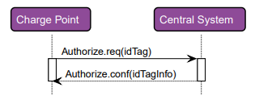
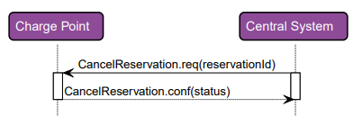
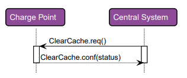
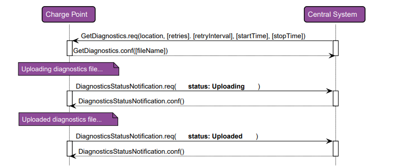
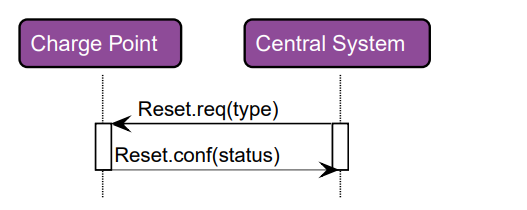
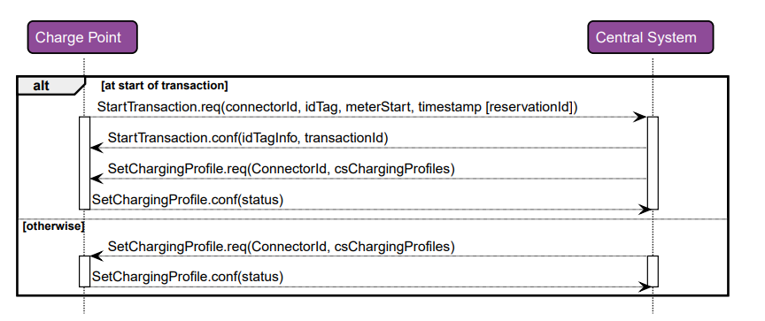
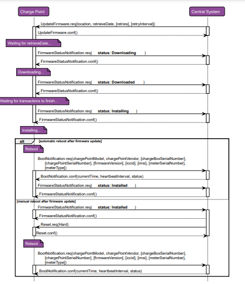

# SpringOcpp
# Implementando um teste para comunicação com estação de recarga usando o o protocolo OCPP

O intuito desse projeto é aprender a operar e entender como funciona o OCPP. Por enquanto o único público alvo desse trabalho é o próprio autor.

## Sumário


1. [Breve resumo sobre o OCPP](#breve)
2. [ Implementações feitas nesse projeto. ](#imple)
3. [ Operações realizadas no projeto (central) ](#projeto)
4. [ Operações iniciadas pela estação de recarga ](#carga)
5. [ Operações iniciadas pela Central ](#central)

<a name="breve"></a>
## Breve resumo sobre o OCPP
O OCPP é um protocolo desenvolvido pela Open Charge Alliance. O OCPP é um protocolo de aplicação
de comunicação entre estações de recarga, veículos elétricos e a central de de gerenciamento. Um dos pontos importantes 
do projeto é tornar essa interação fácil e livre
sendo possível ser utilizada em qualquer estação de recarga.


<a name="imple"></a>
## Implementações feitas nesse projeto:
BootNotification;
Heartbeat;
StatusNotification;
StartTransaction;

<a name="projeto"></a>
## Operações realizadas no projeto (central):

A central se comunica com a estação através de WebSocket. A central faz o papel de servidor enquanto que o cliente é a estação de recarga.
Todas as operações controladas pelo WebSocket são gerenciadas pelo [Handler](https://github.com/LucasJordi/SpringOcppTeste/blob/master/src/main/java/com/ocppWebSocket/ocppWebSocket/MyHandler.java).

Assim que a estação de recarga se comunica com a rota /central e a conexão é feita com sucesso, é acionado o parâmetro *afterConnectionEstablished* que informa que a conexão foi feita com sucesso através do controlardor [NameOfStationsConnected](https://github.com/LucasJordi/SpringOcppTeste/blob/master/src/main/java/com/ocppWebSocket/ocppWebSocket/controller/NameOfStationsConnected.java).

A estação envia uma requisição BootNotification e espera receber uma resposta BootNotification.

##### Exemplo de requisição BootNotification feita pela estação de recarga:

```

[2,
 "19223201",
 "BootNotification",
 {"chargePointVendor": "VendorX", "chargePointModel": "SingleSocketCharger"}
]

```


##### Exemplo de resposta BootNotification feita pelo servidor:

```

[3,
 "19223201",
 {"status":"Accepted", "currentTime":"2013-02-01T20:53:32.486Z", "heartbeatInterval":300}
]

```

Se a operação de BootNotification for aceita pela estação, a mesma envia um status com as informações pertinentes (número de conectores, status dos conectores e etc).

##### Exemplo de envio StatusNotification feita pela estação:

```
[2,
 "2",
 "StatusNotification",
 {"timestamp":"2021-09-02T12:03:32.874Z","connectorStatus":"Available","evseId":1,"connectorId":1}
]

``` 

É possível checar os dados da sessão do WebSocket na rota /connect:

```
 {"id":"9b53fae7-2d41-3d6d-4427-62341b103f02","session":"ws://localhost:8080/central/EVB-P17390866","client":"ok"}
```
O "id" referencia o id da sessão, o "session" é a rota no qual a estação/cliente entrou em contato com o WebSocket.

<a name="carga"></a>
## Operações iniciadas pela estação de recarga:

### Authorize


Antes que o dono do veículo possa iniciar a recarga, a estação precisa autorizar a operação.


### Boot Notification


Após a estação inicializar é feita uma requisição a central com os seus dados de configuração. A estação aguarda a resposta em status "Accepted" para prosseguir com a operação.
Toda vez que o sistema inicializa ou reinicializa essa operação é feita.


### Data Transfer


Quando a estação precisa mandar informações para central com funções não suportadas pelo OCPP utiliza-se o DataTransfer.


### Diagnostics Status Notification


A estação envia notificações sobre o status de diagnostico de envio.

### Firmaware Status


### Heartbeat


Para que a central saiba que a estação de recarga continua conectada, o ponto de recarga envia uma notificação Heartbeat a um dado intervalo de tempo.

### Start Transaction


O ponto de recarga envia uma notificação StartTransaction para a central para informar que a operação de recarga foi iniciada.

### Status Notification


A estação de recarga envia uma notificação para a central para informar sobre mudanças de status ou possiveis erros que acontecem com a estação.

### Stop Transaction


Quando uma operação termina ou é parada, a estação envia uma notificação do tipo StopTransaction informando que a transação foi finalizada.

<a name="central"></a>
## Operações iniciadas pela Central:

### Cancel Reservation


### Change Availability


### Change Configuration


### Clear Cache


### Clear Chargin Profile


### Data Transfer


### Get Composite Schedule


### Get Configuration


### Get Diagnostics


### Get Local List Version


### Remote Start Transaction


### Remote Stop Transaction


### Reserve Now


### Reset


### Send Local List


### Set Charging Profile


### Trigger Message


### Unlock Connector


### Update Firmware



